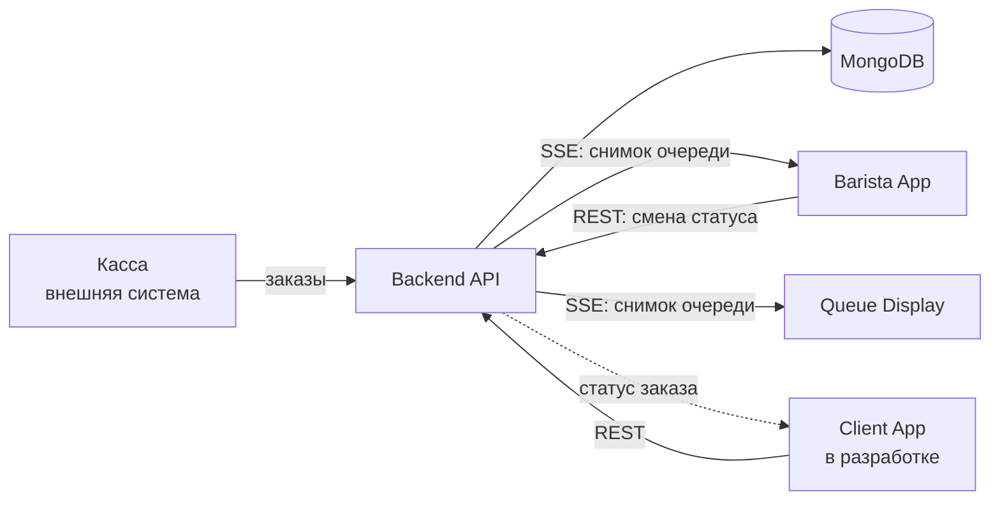

# Brewline

> Виртуальная очередь для кофейни и учебный multi-repo проект, в котором я прохожу полный цикл разработки системы — от анализа проблемы и архитектуры до реализации, CI/CD и деплоя.


## Проблема

В часы пик готовые заказы легко теряются в потоке: гости не слышат, что напиток готов, спрашивают о статусе, а бариста отвлекаются от приготовления. Ситуация усложняется, когда заказы поступают из нескольких источников, а их состояние нужно одинаково отображать на разных устройствах.

Brewline собирает заказы в единую цифровую очередь. Бариста ведёт её со своего устройства, а изменения статуса синхронно появляются на публичном табло и, в следующем инкременте, на странице заказа клиента.

Ключевой сценарий системы:

```text
бариста меняет статус → backend сохраняет изменение → все экраны получают новый снимок очереди
```

## Что уже работает

- единая очередь заказов в MongoDB;
- REST API для чтения очереди и изменения статусов;
- явные правила переходов между статусами заказа;
- live-обновление интерфейсов через Server-Sent Events (SSE);
- публичное табло очереди для гостей;
- интерфейс бариста с авторизацией через серверную сессию и `httpOnly` cookie;
- единый API-контракт: `zod → OpenAPI → @brewline/api-types → frontend`;
- локальный запуск backend и MongoDB через Docker Compose;
- проверки форматирования, линтинга и сборки в CI.

## Как устроена система



Backend владеет заказами и выступает единым источником истины. После изменения статуса он отправляет не отдельное событие-дельту, а канонический снимок очереди. Благодаря этому интерфейсы не собирают состояние самостоятельно и показывают одинаковые данные.

Система разделена по контейнерам C4 на независимые репозитории. Это добавляет задачи по версионированию контракта, настройке адресов и CI/CD, но позволяет отработать устройство, близкое к реальной разработке нескольких сервисов.

## Репозитории

| Репозиторий                                                         | Роль                                                                |
| ------------------------------------------------------------------- | ------------------------------------------------------------------- |
| [`brewline-backend`](https://github.com/Nikolskii/brewline-backend) | REST API, бизнес-правила, MongoDB, SSE и источник OpenAPI-контракта |
| [`brewline-client`](https://github.com/Nikolskii/brewline-client)   | Веб-форма заказа и просмотр клиентом статуса своего заказа          |
| [`brewline-barista`](https://github.com/Nikolskii/brewline-barista) | Рабочее место бариста: вход, просмотр очереди и смена статусов      |
| [`brewline-display`](https://github.com/Nikolskii/brewline-display) | Публичное табло с live-обновлением очереди                          |
| [`brewline-infra`](https://github.com/Nikolskii/brewline-infra)     | Общая инфраструктура, MongoDB и будущий деплой в k3s                |
| [`brewline-docs`](https://github.com/Nikolskii/brewline-docs)       | Архитектурный обзор, описания компонентов, диаграммы и ADR          |

## Технологии

| Область            | Технологии и практики                                                        |
| ------------------ | ---------------------------------------------------------------------------- |
| Frontend           | React, TypeScript, Vite, TanStack Query, SCSS Modules                        |
| Backend            | Node.js, Express, TypeScript, Zod                                            |
| Данные и real-time | MongoDB, REST, SSE                                                           |
| Контракт           | Zod, OpenAPI, npm-пакет `@brewline/api-types`                                |
| Инфраструктура     | Docker, Docker Compose; далее — GHCR, k3s, Helm, Nginx Ingress, cert-manager |
| Качество           | ESLint, Prettier, Vitest, GitHub Actions, pull request checks                |
| Проектирование     | C4, BPMN, ADR, вертикальные срезы, демо и ретроспективы                      |

## Что я отрабатываю на проекте

Brewline — не попытка представить учебный проект готовым продуктом для внедрения в кофейнях. Его основная ценность для меня — инженерный процесс и переход от взгляда «только frontend» к пониманию системы целиком.

На проекте я получаю практический опыт в нескольких направлениях:

- **Системный анализ и архитектура:** формулирую проблему и границы системы, описываю пользовательские процессы, выделяю контейнеры и фиксирую архитектурные решения в ADR.
- **Backend и данные:** проектирую REST API, модель заказов и автомат статусов, работаю с MongoDB, серверными сессиями и real-time доставкой данных через SSE.
- **Контракт между сервисами:** поддерживаю цепочку от runtime-схем Zod до OpenAPI и версионируемого npm-пакета с типами для фронтендов.
- **Инфраструктура и delivery:** использую Docker и CI, изучаю публикацию образов, Helm, Kubernetes/k3s, ingress и управление секретами.
- **Организация разработки:** декомпозирую продукт на тонкие вертикальные срезы, веду multi-repo, провожу демо и ретроспективу после каждого инкремента.
- **Агентная разработка с ИИ:** строю AI-среду проекта из правил `AGENTS.md`, переиспользуемых skills и специализированных агентов. Использую их для декомпозиции, документации, проектирования и реализации, сохраняя инженерные решения и проверку результата за собой.

## Прогресс

- [x] **Инкремент 1 — живая очередь:** смена статуса на backend обновляет табло через SSE.
- [x] **Инкремент 2 — бариста ведёт очередь:** авторизация, рабочее место бариста и синхронное обновление табло.
- [ ] **Инкремент 3 — клиентский сценарий:** веб-форма заказа и просмотр статуса своего заказа.
- [ ] **Инкремент 4 — production-контур:** Docker-образы, GHCR, Helm и деплой в k3s.

Подробное устройство системы и принятые решения собраны в [`brewline-docs`](https://github.com/Nikolskii/brewline-docs). Инструкции по локальному запуску находятся в README соответствующих сервисов.
